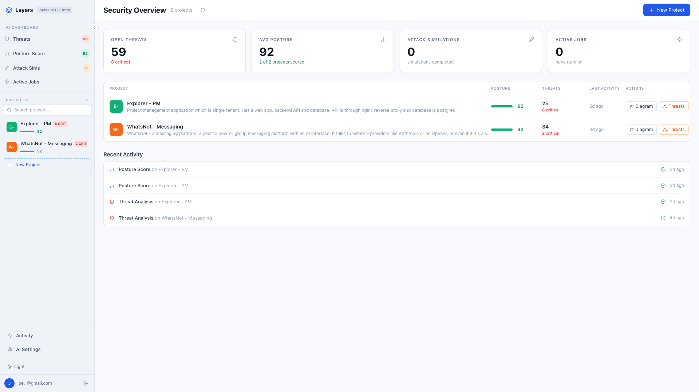
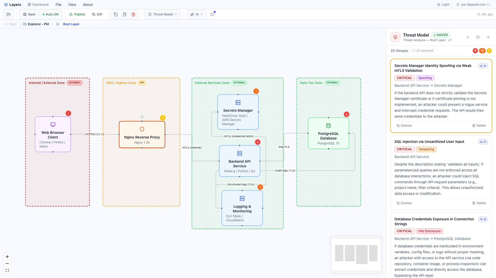
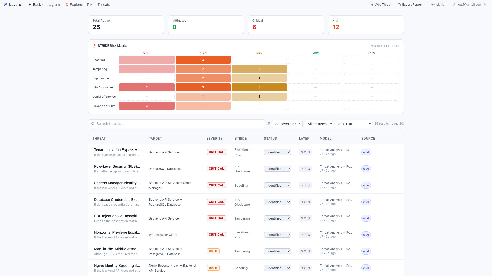
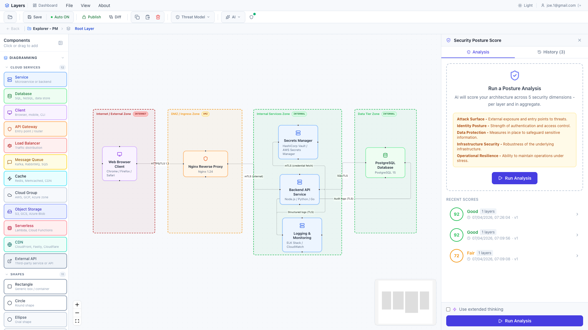
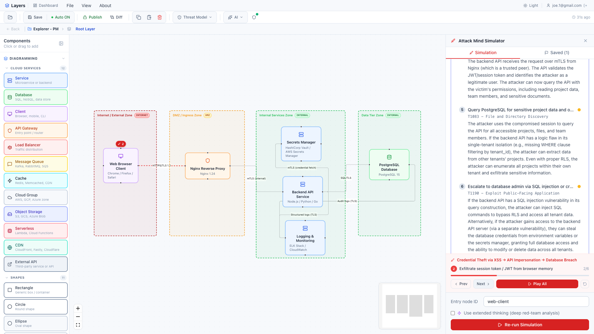
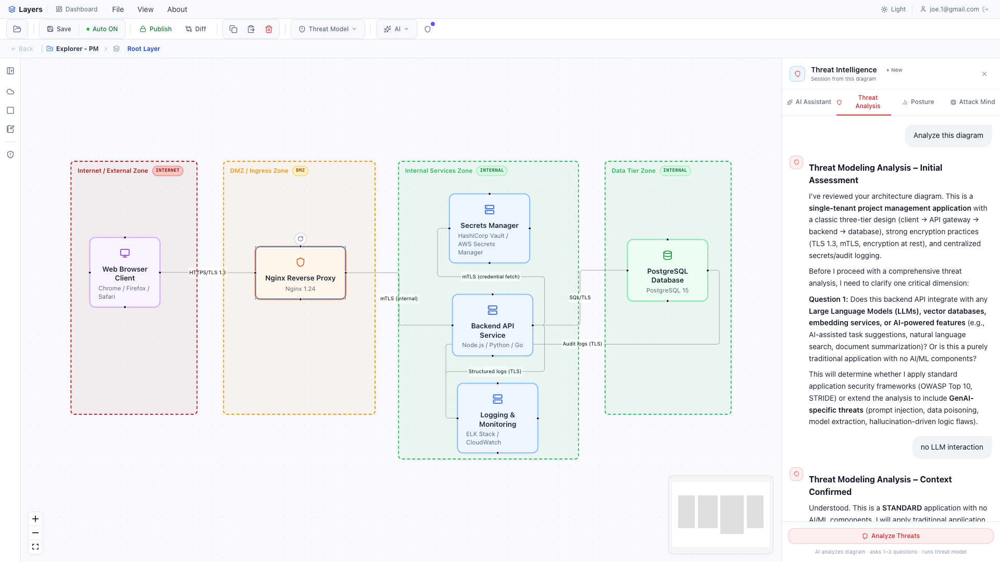
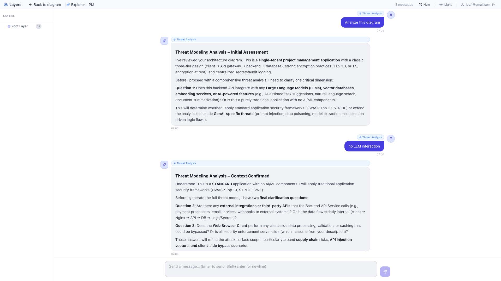
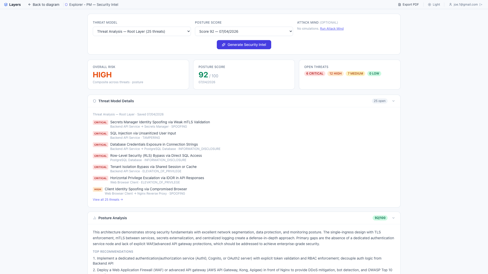
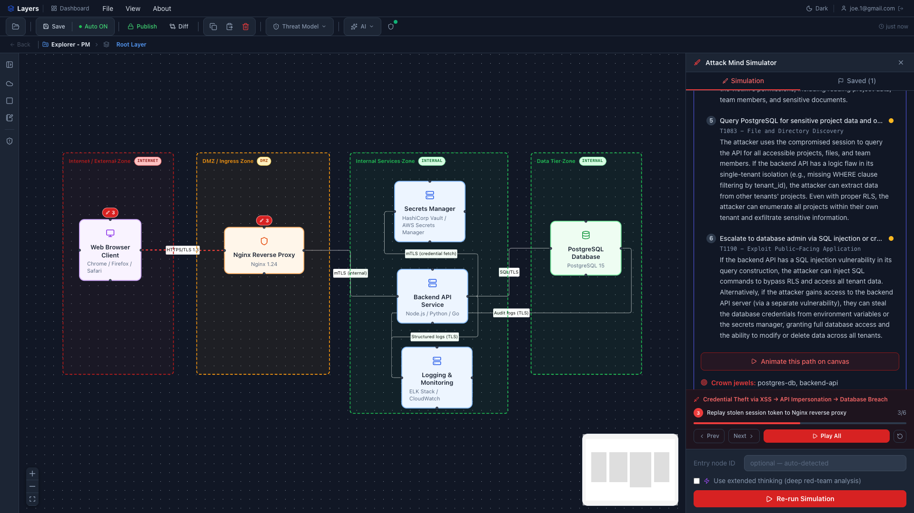

# Layers

**Security-first architecture threat modeling, posture scoring and attack simulation - AI-native.**

Most threat modeling happens after architecture decisions are locked in. By then, every finding is expensive rework. Layers brings threat analysis, posture scoring and attack simulation to design time - where it's still cheap to fix.



---

## What it does

Draw or generate your architecture. Layers reads every node, edge and trust boundary - detects whether you're building a web application, a GenAI pipeline or an agentic AI system - and applies the right threat framework automatically. No manual configuration.

From there, a continuous loop:

1. **Threat modeling** - AI surfaces threats with severity, STRIDE category and CISSP domain. Trust boundaries elevate severity when data flows cross zones without encryption or authentication.
2. **Security posture scoring** - quantified score across five dimensions: Identity & Access, Data Protection, Infrastructure Security, Operational Resilience, Supply Chain. Every deduction comes with a reason and a fix.
3. **Attack simulation** - AI constructs realistic kill chains from your entry points to your crown jewels. Multi-step attack paths with per-step technique and success likelihood.
4. **Security Intel** - synthesizes all three analyses into an executive summary with PDF export.
5. **Evolve** - publish a new architecture version, diff it against the previous one visually, watch your posture score improve over time.

---

## Screenshots

| Threat model on architecture | Threats dashboard |
|---|---|
|  |  |

| Security posture scoring | Attack simulation |
|---|---|
|  |  |

| AI threat analysis | AI assistant & history |
|---|---|
|  |  |

| Security intelligence | Dark mode |
|---|---|
|  |  |

---

## Tech stack

| Layer | Technology |
|---|---|
| Frontend | Next.js 15, React 19, React Flow 11, Tailwind CSS, TypeScript |
| Backend | NestJS 10, Node.js |
| AI | Anthropic Claude (primary), OpenAI, Ollama - user-selectable per project |
| ORM | Prisma 5 |
| Database | PostgreSQL 16 |
| Vector store | ChromaDB (RAG / semantic history search) |
| Job queue | BullMQ + Redis 7 (async AI job pipeline) |
| Storage | Supabase (thumbnails / blob storage) |
| PDF | PDFKit (pure JS, no Java dependency) |

---

## Features

### Architecture diagramming
- Visual canvas with 22 node types - cloud services, generic shapes, trust boundaries
- Multi-layer drill-down (container → component → code layers)
- AI diagram generation from plain language descriptions
- Undo/redo, copy/paste, alignment guides, z-ordering
- AI chat panel with full diagram context (Cmd+I)

### Threat modeling
- Streaming STRIDE threat analysis across all nodes and edges
- Auto-detects application type (web/cloud, GenAI, agentic AI) from diagram content - applies OWASP Top 10, OWASP LLM Top 10 or OWASP Agentic AI Top 10 automatically
- Trust boundary nodes with zone levels: Internet / DMZ / External / Internal
- Threats dashboard - paginated, filterable by severity, STRIDE category, status
- Threat lifecycle: `IDENTIFIED → IN_PROGRESS → MITIGATED → ACCEPTED → FALSE_POSITIVE`
- User-defined manual threat entry
- PDF threat report export

### Security posture scoring
- Scored across five dimensions with per-dimension breakdown
- Every deduction includes reason, CISSP domain and recommended fix
- Score history preserved per architecture version
- Streaming posture assessment

### Attack simulation
- AI red-teams your architecture from specified entry points
- Multi-step kill chains with target node, attack technique and success likelihood
- Simulation history linked to diagram version

### Security intelligence
- Synthesizes posture score + threat model + attack simulation into one view
- Executive summary with PDF export
- POST `/ai/intel-synthesis` - full analysis in a single call

### Version control
- Publish / Draft / Checkout lifecycle (enforced frontend and backend)
- Version comments and history
- Visual diff - split-view canvas with color-coded Added / Modified / Removed / Unchanged overlays
- Frontend-only diff engine - no backend round-trip
- All security analysis artifacts linked to the version they were run against

### AI infrastructure
- Dual AI provider support - Anthropic, OpenAI or Ollama per user for local development
- API keys stored AES-256-GCM encrypted in Postgres (encryption key never leaves backend)
- Long-running jobs (threat analysis, posture score, attack simulation) processed via BullMQ async pipeline
- Results streamed back via Server-Sent Events (SSE)
- RAG history chat via ChromaDB semantic search - ask questions across your full project history

---

## Running locally

### Prerequisites

- Node.js 20+
- Docker and Docker Compose

### 1. Clone both repos

```bash
git clone https://github.com/sunilkrpv/layers-rest layers-rest
git clone https://github.com/sunilkrpv/layers layers
```

### 2. Start infrastructure

```bash
cd layers-rest
cp .env.example .env.local
# Fill in JWT secrets in .env.local
docker-compose up -d
```

This starts PostgreSQL 16, ChromaDB and Redis 7.

### 3. Run database migrations

```bash
npm install
npm run db:migrate
```

### 4. Start the backend

```bash
npm run start:dev
```

### 5. Start the frontend

```bash
cd ../layers
cp .env.example .env.local
npm install
npm run dev
```

Open [http://localhost:3000](http://localhost:3000).

---

## Environment variables

### Backend (`layers-rest/.env.example`)

| Variable | Description |
|---|---|
| `DATABASE_URL` | Pooled PostgreSQL connection string |
| `DIRECT_URL` | Direct PostgreSQL connection (for migrations) |
| `JWT_SECRET` | Access token signing secret |
| `JWT_REFRESH_SECRET` | Refresh token signing secret |
| `REDIS_URL` | Redis connection URL |
| `CHROMA_URL` | ChromaDB server URL |


---

## Architecture notes

**BullMQ async job pipeline** - long-running AI analyses are submitted as jobs and tracked via `AiJob`. Frontend polls `GET /ai/projects/:id/pipeline-status` and results stream back via SSE. This keeps the UI responsive during deep analysis runs.

**Encrypted AI credentials** - user-supplied API keys (Anthropic, OpenAI) are stored AES-256-GCM encrypted in Postgres. The encryption key never leaves the backend process.

**Frontend-only diff engine** - `diffProjects()` in `lib/diffEngine.ts` runs entirely in the browser. No backend round-trip for architecture version comparison.

**Recursive layer model** - each node can drill into a child layer. Layers are persisted as a flat `Record<string, Layer>` structure with cascade delete logic.

---

## Roadmap

- [ ] MITRE ATT&CK mapping on attack simulation findings
- [ ] Diff-aware scoped re-simulation on version change
- [ ] Collaboration (organization, multi-users, share, comments)

---

## License

MIT - see [LICENSE](LICENSE)

---

Built by [@sunilkrpv](https://github.com/sunilkrpv) · [layerssec.com](https://layerssec.com)